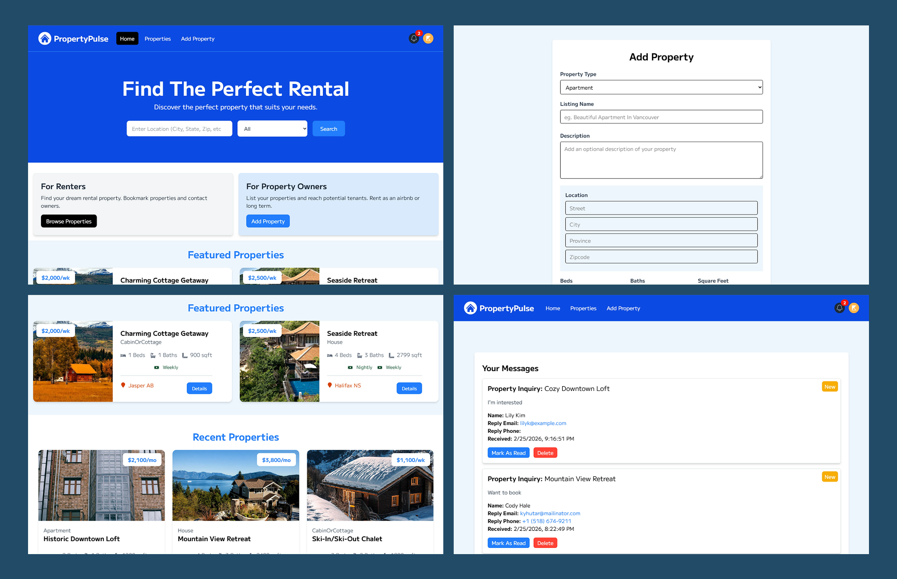
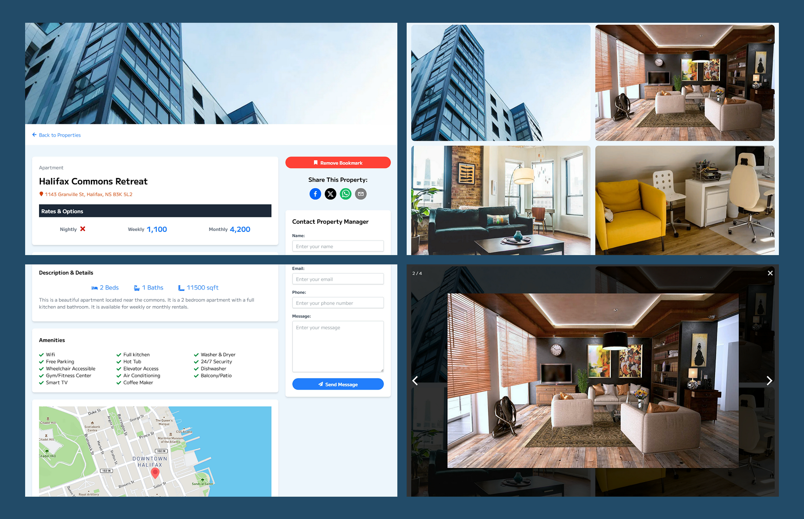
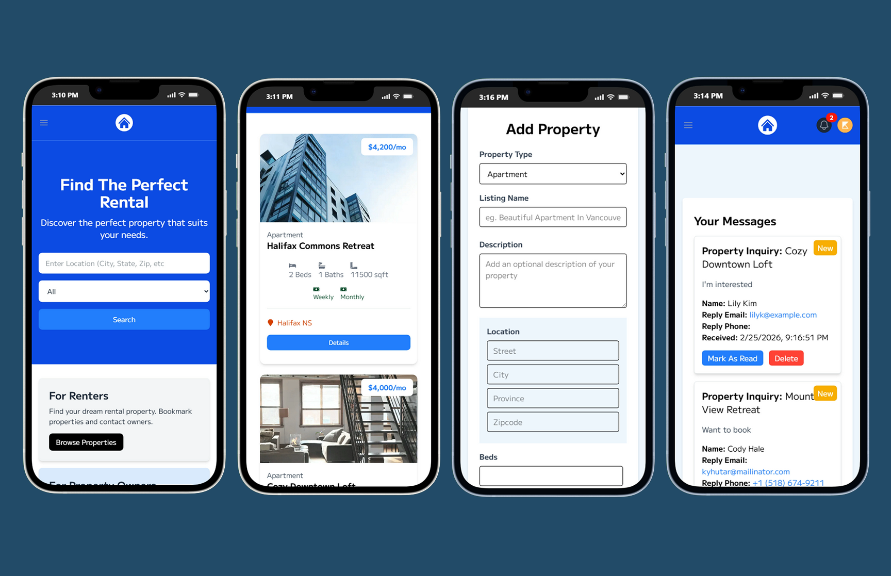
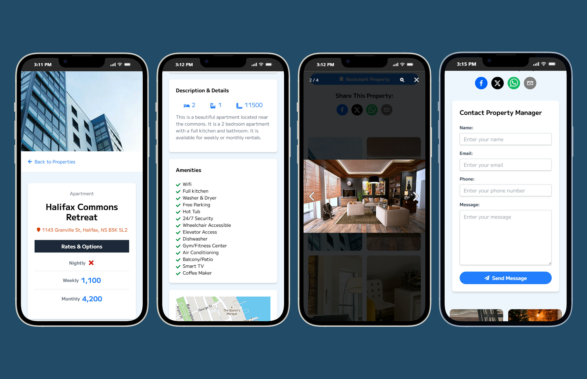

# Property Pulse | Next.js Full-Stack Real Estate Platform

## Overview

Property Pulse is a modern full-stack real estate platform built with
**Next.js 16 (App Router) and React 19, leveraging Server Components and Server Actions**.

Users can:

- Authenticate with Google OAuth
- Create and manage property listings
- Upload images
- Bookmark properties
- Send messages to property owners
- Search and paginate listings

This project was built while completing a structured Next.js course, with additional improvements and deployment configuration.
 

---

## Screenshots

  
  

 

  
  

---

### ▶ Live Demo

🔗 https://property-pulse.kellybytes.dev/
 

## Core Features

### Authentication
- Google OAuth via NextAuth
- Session management
- Protected routes
- Conditional rendering based on authentication state

### Property Management
- Create property listings
- Edit and delete listings
- Upload multiple images (Cloudinary)
- Featured properties
- Pagination

### User Experience
- Responsive design (Tailwind CSS)
- Toast notifications
- Loading and custom error pages
- Active link highlighting
- Conditional UI rendering

### Advanced Functionality
- Server Actions for data mutations
- Mapbox integration for property location
- Geocoding for latitude/longitude
- Bookmark system
- Messaging system with unread message tracking
- Global state management for message count
- Search functionality
- Lightbox (PhotoSwipe) for image previews
 

## Tech Stack

### Framework
- **Next.js 16 (App Router)**
- **React 19**
- Server Components
- Server Actions

### Database
- MongoDB (Node Driver 7)
- Mongoose 9

### Authentication
- NextAuth.js (Auth.js v4) with Google OAuth

### Maps & Media
- Mapbox GL
- Cloudinary
- PhotoSwipe

### UI
- Tailwind CSS 4
- React Toastify
- React Icons

### Deployment
- Vercel
 

## Architecture Overview

app/ → App Router pages, nested routes, and server actions  
components/ → Reusable UI components  
models/ → Mongoose data models  
config/ → Database & Cloudinary configuration  
context/ → Global state management  
utils/ → Helper functions  
middleware.js → Route protection & session validation  

The project follows a feature-oriented structure using the App Router:

- Server Actions are colocated under `app/actions`
- Route segments use dynamic routing (`[id]`)
- Authentication is handled via NextAuth route handlers
- Global state is managed through React Context
- MongoDB models are centralized in `/models`

### Architectural Highlights

- App Router architecture (Next.js 16)
- Clear separation between:
  - Server Components (data fetching & performance optimization)
  - Client Components (stateful interactivity)
- Server Actions for secure data mutations
- Lean MongoDB documents to prevent serialization issues
- Protected routes via session validation
- Environment-based configuration for secrets and API keys
 

## Key Technical Learnings

### 1. Server vs Client Components

Understanding when to use:
- Server Components → data fetching & performance
- Client Components → state, hooks, interaction

This significantly improved performance and reduced unnecessary client-side JavaScript.

### 2. Server Actions & Secure Data Mutations

Instead of relying solely on API routes, this project uses **Server Actions** to:
- Submit property data
- Delete properties
- Bookmark listings
- Send messages

This improved:
- Security (no exposed mutation endpoints)
- Developer experience
- Code organization

### 3. Authentication & Session-Based Authorization

- Implemented Google OAuth
- Persisted users to MongoDB
- Restricted routes for authenticated users
- Associated listings and messages with users

This reflects real-world SaaS application patterns.

### 4. Handling Real-World Concerns

This project includes solutions for:
- Pagination for scalable data retrieval
- Lean document serialization to avoid Next.js errors
- Graceful loading and error handling
- Deployment configuration for environment variables
- Managing third-party services (Cloudinary, Mapbox)
 

## Deployment

The application is deployed to **Vercel**, leveraging:
- Automatic GitHub integration
- Environment variable configuration
- Production build optimization
 

## Future Improvements

- Role-based access control (Admin)
- Stripe integration for premium listings
- Caching strategies (ISR / revalidation)
- Testing (Jest / React Testing Library)
- API rate limiting
- Performance monitoring
 

## Why This Project Matters

Property Pulse demonstrates my ability to:
- Build a production-ready full-stack application with Next.js
- Implement authentication and protected routes
- Manage database relationships
- Handle third-party integrations
- Deploy and manage a cloud-based application

It reflects a strong understanding of modern React and Next.js architecture beyond basic CRUD functionality.
 

---

[🔼 Back to Top](#property-pulse--nextjs-full-stack-real-estate-platform)